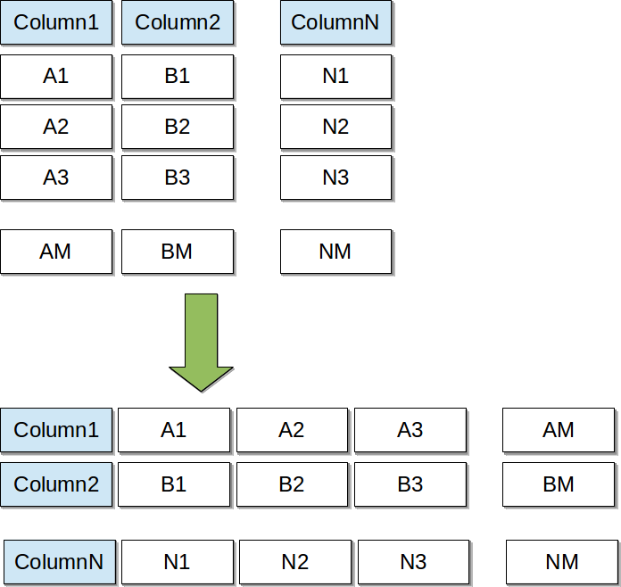

# txt-archive

[](https://travis-ci.org/wizardjedi/txt-archive.svg?branch=master)
[](https://codecov.io/gh/wizardjedi/txt-archive)

# Motivation

We have a huge amount of immutable data. In other words it's a immutable but appendable log.
Our storage contains hundreds of gigabytes of archived CSV-files. In this case we have operations like batch append and rarely(for example, 1 time per few months) search.

So we have well defined and well known structure and values in files. We don't need indexes because search operations are very rare. And most valuable for us is effectiveness of data storage.

We tried:
 * Apache Parquet
 * Apache Avro
 * Compressed parquet and avro
 * Compressed CSV-files

In our tests compressed CSV-files were the best in case of disk space.

# Specification

Archive file - human readable text with compression/repetition rules. Main idea - group data to bunch of rows and store data by columns instead of rows. In this case we can use extra optimizations for data compression: 
 * repetiton of values instead of full list of values
 * delta coding for int values
 * date time to int conversion and decreasing precision




## Archive file format

```
archive:[SCHEMA]
bunch:[SIZE]
[bunch data]
bunch:[SIZE]
[bunch data]
...
bunch:[SIZE]
[bunch data]
```

## Common rules

 * value - value itself
 * [count]*value - duplicate value count times
 * \N - null-reference represent null value
 * '=' - separator for prefix and repetition group
 
## Example
 
 Archive contains 1 bunch of 3 rows. Archive contains fields:
  * transaction_id
  * sms_text
  * add_date
  * delivered_count
 
 ```
 archive:transaction_id=integer,sms_text=text,add_date=date,delivered_count=integer
 bunch:3
 1025456122=0;1;2
 3*"This is sms text"
 1506862923=0;10;20
 0=3*1
 ```
 equals to
  
 ```
 transaction_id;sms_text;add_date;delivered_count
 1025456122;"This is sms text";"2017-10-01 16:02:03";1
 1025456123;"This is sms text";"2017-10-01 16:02:13";1
 1025456124;"This is sms text";"2017-10-01 16:02:23";1
 ```

# Column types
 * String
 * Integer/Numeric
 * Enum
 * DateTime

## String column
TODO!

## Integer/Numeric column
Delta coding

## Enum
Create dictionary (default dictionary for global values and local dictionary for bunch) of values and use indexes instead of values.

## DateTime
Convert date/time to timestamp and reduce precision. For example in SMPP protocol only minutes returning in case of delivery report. So we can reduce second part and save diskspace.
